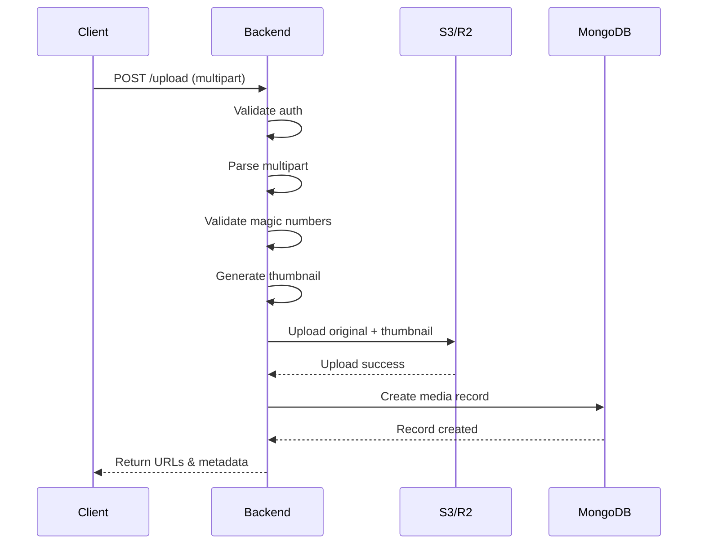

# File Upload Strategy

## Overview

This document describes the comprehensive file upload architecture for handling media files (images) in our application. The system supports multiple storage backends, implements strict validation, and provides efficient image processing capabilities.

### Architecture Diagram

```
┌─────────────┐     ┌──────────────┐     ┌─────────────┐     ┌─────────────┐
│   Client    │────▶│   Backend    │────▶│   Storage   │────▶│    CDN      │
│  (Upload)   │     │ (Validation) │     │ (S3/R2/MinIO)│     │ (Delivery)  │
└─────────────┘     └──────────────┘     └─────────────┘     └─────────────┘
                           │
                           ▼
                    ┌──────────────┐
                    │   MongoDB    │
                    │ (Metadata)   │
                    └──────────────┘
```

### Key Features

- **Multi-provider support**: AWS S3, Cloudflare R2, MinIO (local dev)
- **Direct upload capability**: Pre-signed URLs for large files
- **Image processing**: Thumbnails, EXIF extraction, WebP conversion
- **Security**: Magic number validation, size limits, private buckets
- **Cleanup**: Orphaned file detection and removal

---

## Supported File Types and Formats

### Image Formats

| Format | Extension | MIME Type | Support Level |
|--------|-----------|-----------|---------------|
| JPEG   | .jpg, .jpeg | image/jpeg | Full support |
| PNG    | .png | image/png | Full support |
| WebP   | .webp | image/webp | Full support (recommended) |

### File Size Limits

```go
const (
    // MaxFileSize - Maximum size for individual files (5MB)
    MaxFileSize = 5 * 1024 * 1024

    // MaxTotalSize - Maximum total upload size (20MB)
    MaxTotalSize = 20 * 1024 * 1024

    // MaxFilesPerRequest - Maximum files per upload request
    MaxFilesPerRequest = 10
)
```

### MIME Type Validation

MIME type validation is performed at two levels:

1. **Client-side** (informative only): File extension check
2. **Server-side** (authoritative): Magic number validation

### Magic Numbers (File Signatures)

```go
var imageMagicNumbers = map[string][]byte{
    "image/jpeg": {0xFF, 0xD8, 0xFF},
    "image/png":  {0x89, 0x50, 0x4E, 0x47, 0x0D, 0x0A, 0x1A, 0x0A},
    "image/webp": {0x52, 0x49, 0x46, 0x46}, // "RIFF" header
}

func validateMagicNumber(data []byte, expectedMime string) bool {
    magic, ok := imageMagicNumbers[expectedMime]
    if !ok {
        return false
    }
    
    if len(data) < len(magic) {
        return false
    }
    
    return bytes.Equal(data[:len(magic)], magic)
}
```

---

## Upload Flow

### Standard Upload Flow

```
1. Client prepares multipart/form-data request
2. Client sends POST /api/v1/upload
3. Backend validates authentication
4. Backend parses multipart form
5. Backend validates file size
6. Backend validates file type (magic numbers)
7. Backend processes image (thumbnails, EXIF)
8. Backend uploads to storage provider
9. Backend creates MongoDB media record
10. Backend returns upload response with URLs
```

### Direct Upload Flow (Pre-signed URLs)

For large files or when you want to offload bandwidth:

```
1. Client requests pre-signed URL: POST /api/v1/upload/presign
   Body: {"filename": "photo.jpg", "contentType": "image/jpeg", "size": 5242880}

2. Backend validates and generates pre-signed URL
   Response: {
     "uploadURL": "https://bucket.s3.amazonaws.com/...",
     "fields": {...},
     "mediaId": "media_abc123"
   }

3. Client uploads directly to storage provider

4. Client confirms upload: POST /api/v1/upload/confirm
   Body: {"mediaId": "media_abc123"}

5. Backend verifies file exists and creates MongoDB record
```

### Sequence Diagram



---

## Storage Providers

### AWS S3 Configuration

```go
package storage

import (
    "context"
    "github.com/aws/aws-sdk-go-v2/aws"
    "github.com/aws/aws-sdk-go-v2/config"
    "github.com/aws/aws-sdk-go-v2/credentials"
    "github.com/aws/aws-sdk-go-v2/service/s3"
)

type S3Config struct {
    Region          string
    Bucket          string
    AccessKeyID     string
    SecretAccessKey string
    Endpoint        string // Optional: for custom endpoints
}

func NewS3Client(cfg *S3Config) (*s3.Client, error) {
    awsCfg, err := config.LoadDefaultConfig(context.Background(),
        config.WithRegion(cfg.Region),
        config.WithCredentialsProvider(
            credentials.NewStaticCredentialsProvider(
                cfg.AccessKeyID,
                cfg.SecretAccessKey,
                "",
            ),
        ),
    )
    if err != nil {
        return nil, fmt.Errorf("failed to load AWS config: %w", err)
    }

    var client *s3.Client
    if cfg.Endpoint != "" {
        // Custom endpoint (for S3-compatible services)
        client = s3.NewFromConfig(awsCfg, func(o *s3.Options) {
            o.BaseEndpoint = aws.String(cfg.Endpoint)
            o.UsePathStyle = true
        })
    } else {
        client = s3.NewFromConfig(awsCfg)
    }

    return client, nil
}
```

### Cloudflare R2 Alternative

```go
// R2 is S3-compatible, just use a different endpoint
func NewR2Client(accountID, accessKeyID, secretAccessKey string) (*s3.Client, error) {
    endpoint := fmt.Sprintf("https://%s.r2.cloudflarestorage.com", accountID)
    
    cfg := &S3Config{
        Region:          "auto", // R2 uses "auto" as region
        Bucket:          "my-bucket",
        AccessKeyID:     accessKeyID,
        SecretAccessKey: secretAccessKey,
        Endpoint:        endpoint,
    }
    
    return NewS3Client(cfg)
}
```

### Local Development with MinIO

```go
// MinIO is also S3-compatible
func NewMinIOClient(endpoint, accessKey, secretKey string) (*s3.Client, error) {
    cfg := &S3Config{
        Region:          "us-east-1",
        Bucket:          "local-bucket",
        AccessKeyID:     accessKey,
        SecretAccessKey: secretKey,
        Endpoint:        endpoint, // e.g., "http://localhost:9000"
    }
    
    return NewS3Client(cfg)
}

// Docker Compose for local development
/*
version: '3.8'
services:
  minio:
    image: minio/minio:latest
    ports:
      - "9000:9000"
      - "9001:9001"
    environment:
      MINIO_ROOT_USER: minioadmin
      MINIO_ROOT_PASSWORD: minioadmin
    command: server /data --console-address ":9001"
    volumes:
      - minio_data:/data

volumes:
  minio_data:
*/
```

### Configuration Selection

```go
// config/upload.go
package config

type UploadConfig struct {
    Provider         string        // "s3", "r2", "minio"
    MaxFileSize      int64
    MaxTotalSize     int64
    MaxFiles         int
    AllowedTypes     []string
    ThumbnailSizes   []ThumbnailSize
    PresignExpiry    time.Duration // For pre-signed URLs
    S3               S3Config
    R2               R2Config
    MinIO            MinIOConfig
}

type ThumbnailSize struct {
    Name   string
    Width  int
    Height int
}

func LoadUploadConfig() *UploadConfig {
    return &UploadConfig{
        Provider:     getEnv("STORAGE_PROVIDER", "minio"),
        MaxFileSize:  5 * 1024 * 1024,
        MaxTotalSize: 20 * 1024 * 1024,
        MaxFiles:     10,
        AllowedTypes: []string{"image/jpeg", "image/png", "image/webp"},
        ThumbnailSizes: []ThumbnailSize{
            {Name: "small", Width: 150, Height: 150},
            {Name: "medium", Width: 400, Height: 400},
            {Name: "large", Width: 800, Height: 800},
        },
        PresignExpiry: 15 * time.Minute,
        S3: S3Config{
            Region:          getEnv("AWS_REGION", "us-east-1"),
            Bucket:          getEnv("AWS_BUCKET", "my-app-bucket"),
            AccessKeyID:     getEnv("AWS_ACCESS_KEY_ID", ""),
            SecretAccessKey: getEnv("AWS_SECRET_ACCESS_KEY", ""),
        },
        R2: R2Config{
            AccountID:       getEnv("R2_ACCOUNT_ID", ""),
            Bucket:          getEnv("R2_BUCKET", ""),
            AccessKeyID:     getEnv("R2_ACCESS_KEY_ID", ""),
            SecretAccessKey: getEnv("R2_SECRET_ACCESS_KEY", ""),
        },
        MinIO: MinIOConfig{
            Endpoint:        getEnv("MINIO_ENDPOINT", "http://localhost:9000"),
            Bucket:          getEnv("MINIO_BUCKET", "local-bucket"),
            AccessKey:       getEnv("MINIO_ACCESS_KEY", "minioadmin"),
            SecretKey:       getEnv("MINIO_SECRET_KEY", "minioadmin"),
        },
    }
}
```

---

## Go Implementation

### Upload Handler

```go
// handlers/upload.go
package handlers

import (
    "context"
    "encoding/json"
    "fmt"
    "io"
    "mime/multipart"
    "net/http"
    "path/filepath"
    "strings"
    "time"

    "github.com/go-chi/chi/v5"
    "go.mongodb.org/mongo-driver/bson/primitive"
    "go.uber.org/zap"
)

type UploadHandler struct {
    storageService StorageService
    mediaRepo      MediaRepository
    validator      FileValidator
    processor      ImageProcessor
    logger         *zap.Logger
    config         *config.UploadConfig
}

func NewUploadHandler(
    storageService StorageService,
    mediaRepo MediaRepository,
    validator FileValidator,
    processor ImageProcessor,
    logger *zap.Logger,
    config *config.UploadConfig,
) *UploadHandler {
    return &UploadHandler{
        storageService: storageService,
        mediaRepo:      mediaRepo,
        validator:      validator,
        processor:      processor,
        logger:         logger,
        config:         config,
    }
}

func (h *UploadHandler) Routes() chi.Router {
    r := chi.NewRouter()
    r.Post("/", h.HandleUpload)
    r.Post("/presign", h.HandlePresignURL)
    r.Post("/confirm", h.HandleConfirmUpload)
    r.Get("/{mediaID}", h.HandleGetMedia)
    r.Delete("/{mediaID}", h.HandleDeleteMedia)
    return r
}

// UploadRequest represents a single file upload
// swagger:model
 type UploadRequest struct {
    // File is the uploaded file
    // required: true
    File multipart.File `json:"-"`
    
    // Filename is the original filename
    // required: true
    // example: "vacation_photo.jpg"
    Filename string `json:"filename"`
    
    // ContentType is the MIME type of the file
    // required: true
    // example: "image/jpeg"
    ContentType string `json:"contentType"`
    
    // Size is the file size in bytes
    // required: true
    // example: 1048576
    Size int64 `json:"size"`
}

// UploadResponse represents the response for a successful upload
// swagger:model
 type UploadResponse struct {
    // ID is the unique identifier for the media
    // example: "media_abc123"
    ID string `json:"id"`
    
    // OriginalURL is the URL to access the original file
    // example: "https://cdn.example.com/uploads/abc123/original.jpg"
    OriginalURL string `json:"originalUrl"`
    
    // Thumbnails contains URLs for generated thumbnails
    // example: {"small": "...", "medium": "...", "large": "..."}
    Thumbnails map[string]string `json:"thumbnails,omitempty"`
    
    // Metadata contains extracted file metadata
    Metadata MediaMetadata `json:"metadata"`
    
    // CreatedAt is the upload timestamp
    CreatedAt time.Time `json:"createdAt"`
}

// MediaMetadata contains extracted media information
// swagger:model
 type MediaMetadata struct {
    // Width is the image width in pixels
    Width int `json:"width,omitempty"`
    
    // Height is the image height in pixels
    Height int `json:"height,omitempty"`
    
    // Format is the image format (jpeg, png, webp)
    Format string `json:"format,omitempty"`
    
    // Size is the file size in bytes
    Size int64 `json:"size"`
    
    // EXIF contains extracted EXIF data
    EXIF map[string]interface{} `json:"exif,omitempty"`
}

// HandleUpload handles multipart file uploads
// swagger:route POST /api/v1/upload upload handleUpload
//
// Upload files to the server
//
// Consumes:
// - multipart/form-data
//
// Produces:
// - application/json
//
// Responses:
//   200: UploadResponse
//   400: ErrorResponse
//   413: ErrorResponse "File too large"
//   415: ErrorResponse "Unsupported media type"
//   500: ErrorResponse
func (h *UploadHandler) HandleUpload(w http.ResponseWriter, r *http.Request) {
    ctx := r.Context()

    // Parse multipart form with size limit
    if err := r.ParseMultipartForm(h.config.MaxTotalSize); err != nil {
        h.logger.Warn("Failed to parse multipart form", zap.Error(err))
        respondWithError(w, http.StatusBadRequest, "Invalid form data")
        return
    }
    defer r.MultipartForm.RemoveAll()

    files := r.MultipartForm.File["files"]
    if len(files) == 0 {
        respondWithError(w, http.StatusBadRequest, "No files provided")
        return
    }

    if len(files) > h.config.MaxFiles {
        respondWithError(w, http.StatusBadRequest, 
            fmt.Sprintf("Maximum %d files allowed", h.config.MaxFiles))
        return
    }

    var responses []UploadResponse

    for _, fileHeader := range files {
        // Validate file size
        if fileHeader.Size > h.config.MaxFileSize {
            h.logger.Warn("File too large", 
                zap.String("filename", fileHeader.Filename),
                zap.Int64("size", fileHeader.Size))
            respondWithError(w, http.StatusRequestEntityTooLarge, 
                fmt.Sprintf("File %s exceeds maximum size of %dMB", 
                    fileHeader.Filename, h.config.MaxFileSize/1024/1024))
            return
        }

        // Open file
        file, err := fileHeader.Open()
        if err != nil {
            h.logger.Error("Failed to open uploaded file", zap.Error(err))
            respondWithError(w, http.StatusInternalServerError, "Failed to process file")
            return
        }

        // Validate file type
        validationResult, err := h.validator.Validate(ctx, file, fileHeader)
        if err != nil {
            file.Close()
            h.logger.Warn("File validation failed", 
                zap.String("filename", fileHeader.Filename),
                zap.Error(err))
            respondWithError(w, http.StatusUnsupportedMediaType, 
                fmt.Sprintf("Invalid file: %s", err.Error()))
            return
        }

        // Reset file pointer for processing
        if _, err := file.Seek(0, io.SeekStart); err != nil {
            file.Close()
            h.logger.Error("Failed to reset file pointer", zap.Error(err))
            respondWithError(w, http.StatusInternalServerError, "Failed to process file")
            return
        }

        // Process image (generate thumbnails, extract metadata)
        processed, err := h.processor.Process(ctx, file, validationResult.MimeType)
        if err != nil {
            file.Close()
            h.logger.Error("Failed to process image", zap.Error(err))
            respondWithError(w, http.StatusInternalServerError, "Failed to process image")
            return
        }

        // Upload to storage
        mediaID := primitive.NewObjectID()
        storageKey := h.generateStorageKey(mediaID, validationResult.Extension)

        // Upload original
        originalURL, err := h.storageService.Upload(ctx, storageKey, processed.OriginalData, 
            validationResult.MimeType, processed.Metadata)
        if err != nil {
            file.Close()
            h.logger.Error("Failed to upload to storage", zap.Error(err))
            respondWithError(w, http.StatusInternalServerError, "Failed to store file")
            return
        }

        // Upload thumbnails
        thumbnails := make(map[string]string)
        for name, thumbData := range processed.Thumbnails {
            thumbKey := h.generateThumbnailKey(mediaID, name, validationResult.Extension)
            thumbURL, err := h.storageService.Upload(ctx, thumbKey, thumbData, 
                validationResult.MimeType, nil)
            if err != nil {
                h.logger.Error("Failed to upload thumbnail", 
                    zap.String("thumbnail", name),
                    zap.Error(err))
                continue
            }
            thumbnails[name] = thumbURL
        }

        // Create media record
        media := &models.Media{
            ID:          mediaID,
            Filename:    fileHeader.Filename,
            OriginalURL: originalURL,
            Thumbnails:  thumbnails,
            Size:        fileHeader.Size,
            MimeType:    validationResult.MimeType,
            Width:       processed.Metadata.Width,
            Height:      processed.Metadata.Height,
            Format:      processed.Metadata.Format,
            EXIF:        processed.Metadata.EXIF,
            StorageKey:  storageKey,
            CreatedAt:   time.Now(),
            CreatedBy:   getUserIDFromContext(ctx),
        }

        if err := h.mediaRepo.Create(ctx, media); err != nil {
            file.Close()
            h.logger.Error("Failed to create media record", zap.Error(err))
            respondWithError(w, http.StatusInternalServerError, "Failed to save media metadata")
            return
        }

        file.Close()

        responses = append(responses, UploadResponse{
            ID:          media.ID.Hex(),
            OriginalURL: originalURL,
            Thumbnails:  thumbnails,
            Metadata: MediaMetadata{
                Width:  processed.Metadata.Width,
                Height: processed.Metadata.Height,
                Format: processed.Metadata.Format,
                Size:   fileHeader.Size,
                EXIF:   processed.Metadata.EXIF,
            },
            CreatedAt: media.CreatedAt,
        })
    }

    respondWithJSON(w, http.StatusOK, responses)
}

func (h *UploadHandler) generateStorageKey(mediaID primitive.ObjectID, ext string) string {
    date := time.Now().Format("2006/01/02")
    return fmt.Sprintf("uploads/%s/%s/original.%s", date, mediaID.Hex(), ext)
}

func (h *UploadHandler) generateThumbnailKey(mediaID primitive.ObjectID, name, ext string) string {
    date := time.Now().Format("2006/01/02")
    return fmt.Sprintf("uploads/%s/%s/%s.%s", date, mediaID.Hex(), name, ext)
}
```

### File Validation Service

```go
// services/validator.go
package services

import (
    "bytes"
    "context"
    "encoding/hex"
    "fmt"
    "io"
    "mime/multipart"
    "path/filepath"
    "strings"
)

type FileValidator interface {
    Validate(ctx context.Context, file io.Reader, header *multipart.FileHeader) (*ValidationResult, error)
}

type ValidationResult struct {
    MimeType  string
    Extension string
    IsValid   bool
}

type fileValidator struct {
    allowedTypes []string
    maxSize      int64
    magicNumbers map[string][]byte
}

func NewFileValidator(allowedTypes []string, maxSize int64) FileValidator {
    return &fileValidator{
        allowedTypes: allowedTypes,
        maxSize:      maxSize,
        magicNumbers: map[string][]byte{
            "image/jpeg": {0xFF, 0xD8, 0xFF},
            "image/png":  {0x89, 0x50, 0x4E, 0x47, 0x0D, 0x0A, 0x1A, 0x0A},
            "image/webp": {0x52, 0x49, 0x46, 0x46},
        },
    }
}

func (v *fileValidator) Validate(ctx context.Context, file io.Reader, header *multipart.FileHeader) (*ValidationResult, error) {
    // Check file extension
    ext := strings.ToLower(filepath.Ext(header.Filename))
    if ext == "" {
        return nil, fmt.Errorf("file must have an extension")
    }
    ext = strings.TrimPrefix(ext, ".")

    // Map extension to MIME type
    mimeType := v.extensionToMimeType(ext)
    if mimeType == "" {
        return nil, fmt.Errorf("unsupported file extension: %s", ext)
    }

    // Validate MIME type is allowed
    if !v.isAllowedType(mimeType) {
        return nil, fmt.Errorf("file type not allowed: %s", mimeType)
    }

    // Read first 512 bytes for magic number validation
    buf := make([]byte, 512)
    n, err := io.ReadFull(file, buf)
    if err != nil && err != io.EOF && err != io.ErrUnexpectedEOF {
        return nil, fmt.Errorf("failed to read file: %w", err)
    }
    buf = buf[:n]

    // Validate magic number
    if !v.validateMagicNumber(buf, mimeType) {
        return nil, fmt.Errorf("file content does not match extension: invalid magic number")
    }

    // Additional validation for WebP (check WEBP signature after RIFF)
    if mimeType == "image/webp" && len(buf) >= 12 {
        if !bytes.Equal(buf[8:12], []byte("WEBP")) {
            return nil, fmt.Errorf("invalid WebP file format")
        }
    }

    return &ValidationResult{
        MimeType:  mimeType,
        Extension: ext,
        IsValid:   true,
    }, nil
}

func (v *fileValidator) extensionToMimeType(ext string) string {
    switch ext {
    case "jpg", "jpeg":
        return "image/jpeg"
    case "png":
        return "image/png"
    case "webp":
        return "image/webp"
    default:
        return ""
    }
}

func (v *fileValidator) isAllowedType(mimeType string) bool {
    for _, allowed := range v.allowedTypes {
        if allowed == mimeType {
            return true
        }
    }
    return false
}

func (v *fileValidator) validateMagicNumber(data []byte, expectedMime string) bool {
    magic, ok := v.magicNumbers[expectedMime]
    if !ok {
        return false
    }

    if len(data) < len(magic) {
        return false
    }

    return bytes.Equal(data[:len(magic)], magic)
}

// MagicNumberInfo provides detailed magic number information for debugging
func (v *fileValidator) MagicNumberInfo(data []byte) string {
    if len(data) == 0 {
        return "empty file"
    }
    
    limit := 16
    if len(data) < limit {
        limit = len(data)
    }
    
    return hex.EncodeToString(data[:limit])
}
```

### S3 Storage Service

```go
// services/storage.go
package services

import (
    "bytes"
    "context"
    "fmt"
    "io"
    "time"

    "github.com/aws/aws-sdk-go-v2/aws"
    "github.com/aws/aws-sdk-go-v2/service/s3"
    "github.com/aws/aws-sdk-go-v2/service/s3/types"
)

type StorageService interface {
    Upload(ctx context.Context, key string, data []byte, contentType string, metadata map[string]string) (string, error)
    UploadStream(ctx context.Context, key string, reader io.Reader, contentType string, size int64, metadata map[string]string) (string, error)
    Delete(ctx context.Context, key string) error
    GetPresignedURL(ctx context.Context, key string, expiry time.Duration) (string, error)
    GeneratePresignedUploadURL(ctx context.Context, key string, contentType string, size int64, expiry time.Duration) (*PresignedUploadInfo, error)
    Exists(ctx context.Context, key string) (bool, error)
}

type PresignedUploadInfo struct {
    URL    string
    Fields map[string]string
    Key    string
}

type s3Storage struct {
    client *s3.Client
    bucket string
    cdnURL string
}

func NewS3Storage(client *s3.Client, bucket, cdnURL string) StorageService {
    return &s3Storage{
        client: client,
        bucket: bucket,
        cdnURL: cdnURL,
    }
}

func (s *s3Storage) Upload(ctx context.Context, key string, data []byte, contentType string, metadata map[string]string) (string, error) {
    input := &s3.PutObjectInput{
        Bucket:      aws.String(s.bucket),
        Key:         aws.String(key),
        Body:        bytes.NewReader(data),
        ContentType: aws.String(contentType),
        Metadata:    metadata,
    }

    // Add cache control for better CDN performance
    if isImage(contentType) {
        input.CacheControl = aws.String("public, max-age=31536000, immutable")
    }

    _, err := s.client.PutObject(ctx, input)
    if err != nil {
        return "", fmt.Errorf("failed to upload to S3: %w", err)
    }

    return s.buildURL(key), nil
}

func (s *s3Storage) UploadStream(ctx context.Context, key string, reader io.Reader, contentType string, size int64, metadata map[string]string) (string, error) {
    input := &s3.PutObjectInput{
        Bucket:        aws.String(s.bucket),
        Key:           aws.String(key),
        Body:          reader,
        ContentType:   aws.String(contentType),
        ContentLength: aws.Int64(size),
        Metadata:      metadata,
    }

    if isImage(contentType) {
        input.CacheControl = aws.String("public, max-age=31536000, immutable")
    }

    _, err := s.client.PutObject(ctx, input)
    if err != nil {
        return "", fmt.Errorf("failed to upload stream to S3: %w", err)
    }

    return s.buildURL(key), nil
}

func (s *s3Storage) Delete(ctx context.Context, key string) error {
    _, err := s.client.DeleteObject(ctx, &s3.DeleteObjectInput{
        Bucket: aws.String(s.bucket),
        Key:    aws.String(key),
    })
    if err != nil {
        return fmt.Errorf("failed to delete from S3: %w", err)
    }
    return nil
}

func (s *s3Storage) GetPresignedURL(ctx context.Context, key string, expiry time.Duration) (string, error) {
    presignClient := s3.NewPresignClient(s.client)
    
    req, err := presignClient.PresignGetObject(ctx, &s3.GetObjectInput{
        Bucket: aws.String(s.bucket),
        Key:    aws.String(key),
    }, s3.WithPresignExpires(expiry))
    
    if err != nil {
        return "", fmt.Errorf("failed to generate presigned URL: %w", err)
    }
    
    return req.URL, nil
}

func (s *s3Storage) GeneratePresignedUploadURL(ctx context.Context, key string, contentType string, size int64, expiry time.Duration) (*PresignedUploadInfo, error) {
    presignClient := s3.NewPresignClient(s.client)
    
    // For S3, we use presigned POST for browser uploads
    // This example uses PUT for simplicity
    req, err := presignClient.PresignPutObject(ctx, &s3.PutObjectInput{
        Bucket:        aws.String(s.bucket),
        Key:           aws.String(key),
        ContentType:   aws.String(contentType),
        ContentLength: aws.Int64(size),
    }, s3.WithPresignExpires(expiry))
    
    if err != nil {
        return nil, fmt.Errorf("failed to generate presigned upload URL: %w", err)
    }
    
    return &PresignedUploadInfo{
        URL: req.URL,
        Fields: map[string]string{
            "Content-Type": contentType,
        },
        Key: key,
    }, nil
}

func (s *s3Storage) Exists(ctx context.Context, key string) (bool, error) {
    _, err := s.client.HeadObject(ctx, &s3.HeadObjectInput{
        Bucket: aws.String(s.bucket),
        Key:    aws.String(key),
    })
    
    if err != nil {
        var notFoundErr *types.NotFound
        if ok := errors.As(err, &notFoundErr); ok {
            return false, nil
        }
        return false, fmt.Errorf("failed to check object existence: %w", err)
    }
    
    return true, nil
}

func (s *s3Storage) buildURL(key string) string {
    if s.cdnURL != "" {
        return fmt.Sprintf("%s/%s", strings.TrimSuffix(s.cdnURL, "/"), key)
    }
    return fmt.Sprintf("https://%s.s3.amazonaws.com/%s", s.bucket, key)
}

func isImage(contentType string) bool {
    return strings.HasPrefix(contentType, "image/")
}
```

### MongoDB Media Repository

```go
// repositories/media.go
package repositories

import (
    "context"
    "fmt"
    "time"

    "go.mongodb.org/mongo-driver/bson"
    "go.mongodb.org/mongo-driver/bson/primitive"
    "go.mongodb.org/mongo-driver/mongo"
    "go.mongodb.org/mongo-driver/mongo/options"
)

// Media represents a stored media file
type Media struct {
    ID          primitive.ObjectID     `bson:"_id,omitempty" json:"id"`
    Filename    string                 `bson:"filename" json:"filename"`
    OriginalURL string                 `bson:"originalUrl" json:"originalUrl"`
    Thumbnails  map[string]string      `bson:"thumbnails,omitempty" json:"thumbnails,omitempty"`
    Size        int64                  `bson:"size" json:"size"`
    MimeType    string                 `bson:"mimeType" json:"mimeType"`
    Width       int                    `bson:"width,omitempty" json:"width,omitempty"`
    Height      int                    `bson:"height,omitempty" json:"height,omitempty"`
    Format      string                 `bson:"format,omitempty" json:"format,omitempty"`
    EXIF        map[string]interface{} `bson:"exif,omitempty" json:"exif,omitempty"`
    StorageKey  string                 `bson:"storageKey" json:"-"`
    CreatedAt   time.Time              `bson:"createdAt" json:"createdAt"`
    CreatedBy   primitive.ObjectID     `bson:"createdBy" json:"createdBy"`
    UpdatedAt   time.Time              `bson:"updatedAt,omitempty" json:"updatedAt,omitempty"`
    DeletedAt   *time.Time             `bson:"deletedAt,omitempty" json:"deletedAt,omitempty"`
}

type MediaRepository interface {
    Create(ctx context.Context, media *Media) error
    GetByID(ctx context.Context, id primitive.ObjectID) (*Media, error)
    GetByStorageKey(ctx context.Context, key string) (*Media, error)
    List(ctx context.Context, filter MediaFilter, opts ListOptions) ([]*Media, int64, error)
    Update(ctx context.Context, media *Media) error
    Delete(ctx context.Context, id primitive.ObjectID) error
    SoftDelete(ctx context.Context, id primitive.ObjectID) error
    GetOrphaned(ctx context.Context, before time.Time) ([]*Media, error)
    GetByCreatedBy(ctx context.Context, userID primitive.ObjectID, opts ListOptions) ([]*Media, int64, error)
}

type MediaFilter struct {
    MimeType   string
    CreatedBy  *primitive.ObjectID
    CreatedAfter *time.Time
    CreatedBefore *time.Time
    HasThumbnails bool
}

type ListOptions struct {
    Limit  int64
    Offset int64
    Sort   bson.D
}

type mediaRepository struct {
    collection *mongo.Collection
}

func NewMediaRepository(db *mongo.Database) MediaRepository {
    return &mediaRepository{
        collection: db.Collection("media"),
    }
}

func (r *mediaRepository) Create(ctx context.Context, media *Media) error {
    media.CreatedAt = time.Now()
    media.UpdatedAt = time.Now()
    
    result, err := r.collection.InsertOne(ctx, media)
    if err != nil {
        return fmt.Errorf("failed to insert media: %w", err)
    }
    
    if oid, ok := result.InsertedID.(primitive.ObjectID); ok {
        media.ID = oid
    }
    
    return nil
}

func (r *mediaRepository) GetByID(ctx context.Context, id primitive.ObjectID) (*Media, error) {
    var media Media
    err := r.collection.FindOne(ctx, bson.M{"_id": id, "deletedAt": bson.M{"$exists": false}}).Decode(&media)
    if err != nil {
        if err == mongo.ErrNoDocuments {
            return nil, fmt.Errorf("media not found")
        }
        return nil, fmt.Errorf("failed to get media: %w", err)
    }
    return &media, nil
}

func (r *mediaRepository) GetByStorageKey(ctx context.Context, key string) (*Media, error) {
    var media Media
    err := r.collection.FindOne(ctx, bson.M{"storageKey": key, "deletedAt": bson.M{"$exists": false}}).Decode(&media)
    if err != nil {
        if err == mongo.ErrNoDocuments {
            return nil, fmt.Errorf("media not found")
        }
        return nil, fmt.Errorf("failed to get media: %w", err)
    }
    return &media, nil
}

func (r *mediaRepository) List(ctx context.Context, filter MediaFilter, opts ListOptions) ([]*Media, int64, error) {
    query := bson.M{"deletedAt": bson.M{"$exists": false}}
    
    if filter.MimeType != "" {
        query["mimeType"] = filter.MimeType
    }
    if filter.CreatedBy != nil {
        query["createdBy"] = *filter.CreatedBy
    }
    if filter.CreatedAfter != nil {
        query["createdAt"] = bson.M{"$gte": *filter.CreatedAfter}
    }
    if filter.CreatedBefore != nil {
        if _, ok := query["createdAt"]; ok {
            query["createdAt"] = bson.M{
                "$gte": query["createdAt"].(bson.M)["$gte"],
                "$lte": *filter.CreatedBefore,
            }
        } else {
            query["createdAt"] = bson.M{"$lte": *filter.CreatedBefore}
        }
    }
    if filter.HasThumbnails {
        query["thumbnails"] = bson.M{"$exists": true, "$ne": bson.M{}}
    }

    // Get total count
    total, err := r.collection.CountDocuments(ctx, query)
    if err != nil {
        return nil, 0, fmt.Errorf("failed to count media: %w", err)
    }

    // Set default sort
    if len(opts.Sort) == 0 {
        opts.Sort = bson.D{{Key: "createdAt", Value: -1}}
    }

    findOpts := options.Find().
        SetLimit(opts.Limit).
        SetSkip(opts.Offset).
        SetSort(opts.Sort)

    cursor, err := r.collection.Find(ctx, query, findOpts)
    if err != nil {
        return nil, 0, fmt.Errorf("failed to list media: %w", err)
    }
    defer cursor.Close(ctx)

    var media []*Media
    if err := cursor.All(ctx, &media); err != nil {
        return nil, 0, fmt.Errorf("failed to decode media: %w", err)
    }

    return media, total, nil
}

func (r *mediaRepository) Update(ctx context.Context, media *Media) error {
    media.UpdatedAt = time.Now()
    
    result, err := r.collection.UpdateOne(
        ctx,
        bson.M{"_id": media.ID},
        bson.M{"$set": media},
    )
    if err != nil {
        return fmt.Errorf("failed to update media: %w", err)
    }
    
    if result.MatchedCount == 0 {
        return fmt.Errorf("media not found")
    }
    
    return nil
}

func (r *mediaRepository) Delete(ctx context.Context, id primitive.ObjectID) error {
    result, err := r.collection.DeleteOne(ctx, bson.M{"_id": id})
    if err != nil {
        return fmt.Errorf("failed to delete media: %w", err)
    }
    
    if result.DeletedCount == 0 {
        return fmt.Errorf("media not found")
    }
    
    return nil
}

func (r *mediaRepository) SoftDelete(ctx context.Context, id primitive.ObjectID) error {
    now := time.Now()
    result, err := r.collection.UpdateOne(
        ctx,
        bson.M{"_id": id},
        bson.M{"$set": bson.M{"deletedAt": now, "updatedAt": now}},
    )
    if err != nil {
        return fmt.Errorf("failed to soft delete media: %w", err)
    }
    
    if result.MatchedCount == 0 {
        return fmt.Errorf("media not found")
    }
    
    return nil
}

func (r *mediaRepository) GetOrphaned(ctx context.Context, before time.Time) ([]*Media, error) {
    // Find media that were soft deleted before the specified time
    query := bson.M{
        "deletedAt": bson.M{"$lt": before},
    }
    
    cursor, err := r.collection.Find(ctx, query)
    if err != nil {
        return nil, fmt.Errorf("failed to find orphaned media: %w", err)
    }
    defer cursor.Close(ctx)
    
    var media []*Media
    if err := cursor.All(ctx, &media); err != nil {
        return nil, fmt.Errorf("failed to decode orphaned media: %w", err)
    }
    
    return media, nil
}

func (r *mediaRepository) GetByCreatedBy(ctx context.Context, userID primitive.ObjectID, opts ListOptions) ([]*Media, int64, error) {
    filter := MediaFilter{
        CreatedBy: &userID,
    }
    return r.List(ctx, filter, opts)
}
```

---

## Image Processing

### Thumbnail Generation

```go
// services/image_processor.go
package services

import (
    "bytes"
    "context"
    "fmt"
    "image"
    "image/jpeg"
    "image/png"
    "io"

    "github.com/chai2010/webp"
    "github.com/disintegration/imaging"
    "github.com/rwcarreira/goexif/exif"
    "golang.org/x/image/draw"
)

type ImageProcessor interface {
    Process(ctx context.Context, reader io.Reader, mimeType string) (*ProcessedImage, error)
    GenerateThumbnail(data []byte, width, height int, format string) ([]byte, error)
    ExtractEXIF(data []byte) (map[string]interface{}, error)
    ConvertToWebP(data []byte, quality float32) ([]byte, error)
}

type ProcessedImage struct {
    OriginalData []byte
    Thumbnails   map[string][]byte
    Metadata     *ImageMetadata
}

type ImageMetadata struct {
    Width  int
    Height int
    Format string
    EXIF   map[string]interface{}
}

type imageProcessor struct {
    thumbnailSizes []config.ThumbnailSize
    enableWebP     bool
}

func NewImageProcessor(sizes []config.ThumbnailSize, enableWebP bool) ImageProcessor {
    return &imageProcessor{
        thumbnailSizes: sizes,
        enableWebP:     enableWebP,
    }
}

func (p *imageProcessor) Process(ctx context.Context, reader io.Reader, mimeType string) (*ProcessedImage, error) {
    // Read all data
    data, err := io.ReadAll(reader)
    if err != nil {
        return nil, fmt.Errorf("failed to read image data: %w", err)
    }

    // Decode image to get dimensions
    img, format, err := image.Decode(bytes.NewReader(data))
    if err != nil {
        return nil, fmt.Errorf("failed to decode image: %w", err)
    }

    bounds := img.Bounds()
    metadata := &ImageMetadata{
        Width:  bounds.Dx(),
        Height: bounds.Dy(),
        Format: format,
    }

    // Extract EXIF data
    exifData, err := p.ExtractEXIF(data)
    if err == nil {
        metadata.EXIF = exifData
    }

    // Generate thumbnails
    thumbnails := make(map[string][]byte)
    for _, size := range p.thumbnailSizes {
        thumb, err := p.GenerateThumbnail(data, size.Width, size.Height, format)
        if err != nil {
            continue // Log error but continue with other sizes
        }
        thumbnails[size.Name] = thumb
    }

    // Optionally convert to WebP
    if p.enableWebP && format != "webp" {
        webpData, err := p.ConvertToWebP(data, 85.0)
        if err == nil {
            // Use WebP as primary format if conversion succeeds and is smaller
            if len(webpData) < len(data) {
                data = webpData
                metadata.Format = "webp"
            }
        }
    }

    return &ProcessedImage{
        OriginalData: data,
        Thumbnails:   thumbnails,
        Metadata:     metadata,
    }, nil
}

func (p *imageProcessor) GenerateThumbnail(data []byte, width, height int, format string) ([]byte, error) {
    // Decode image
    img, _, err := image.Decode(bytes.NewReader(data))
    if err != nil {
        return nil, fmt.Errorf("failed to decode image: %w", err)
    }

    // Resize using Lanczos resampling (high quality)
    thumb := imaging.Thumbnail(img, width, height, imaging.Lanczos)

    // Encode based on format
    buf := new(bytes.Buffer)
    switch format {
    case "jpeg", "jpg":
        err = jpeg.Encode(buf, thumb, &jpeg.Options{Quality: 85})
    case "png":
        err = png.Encode(buf, thumb)
    case "webp":
        err = webp.Encode(buf, thumb, &webp.Options{Quality: 85})
    default:
        err = jpeg.Encode(buf, thumb, &jpeg.Options{Quality: 85})
    }

    if err != nil {
        return nil, fmt.Errorf("failed to encode thumbnail: %w", err)
    }

    return buf.Bytes(), nil
}

func (p *imageProcessor) ExtractEXIF(data []byte) (map[string]interface{}, error) {
    exifData, err := exif.Decode(bytes.NewReader(data))
    if err != nil {
        return nil, fmt.Errorf("no EXIF data: %w", err)
    }

    result := make(map[string]interface{})

    // Extract common fields
    if dateTime, err := exifData.DateTime(); err == nil {
        result["dateTime"] = dateTime.Format("2006-01-02 15:04:05")
    }

    if lat, long, err := exifData.LatLong(); err == nil {
        result["gpsLatitude"] = lat
        result["gpsLongitude"] = long
    }

    if make, err := exifData.Get(exif.Make); err == nil {
        result["make"] = make.String()
    }

    if model, err := exifData.Get(exif.Model); err == nil {
        result["model"] = model.String()
    }

    if orientation, err := exifData.Get(exif.Orientation); err == nil {
        result["orientation"] = orientation.String()
    }

    return result, nil
}

func (p *imageProcessor) ConvertToWebP(data []byte, quality float32) ([]byte, error) {
    img, _, err := image.Decode(bytes.NewReader(data))
    if err != nil {
        return nil, fmt.Errorf("failed to decode image: %w", err)
    }

    buf := new(bytes.Buffer)
    if err := webp.Encode(buf, img, &webp.Options{Quality: quality}); err != nil {
        return nil, fmt.Errorf("failed to encode WebP: %w", err)
    }

    return buf.Bytes(), nil
}

// GetImageDimensions returns the dimensions of an image without fully decoding it
func GetImageDimensions(data []byte) (width, height int, format string, err error) {
    config, format, err := image.DecodeConfig(bytes.NewReader(data))
    if err != nil {
        return 0, 0, "", fmt.Errorf("failed to decode image config: %w", err)
    }
    return config.Width, config.Height, format, nil
}
```

### EXIF Data Extraction

Common EXIF fields extracted:

| Field | Description | Example |
|-------|-------------|---------|
| DateTime | Original capture date | 2024-01-15 14:30:00 |
| Make | Camera manufacturer | Canon |
| Model | Camera model | EOS R5 |
| GPSLatitude | GPS latitude | 37.7749 |
| GPSLongitude | GPS longitude | -122.4194 |
| Orientation | Image orientation | 1 (normal) |
| FNumber | Aperture | f/2.8 |
| ExposureTime | Shutter speed | 1/250 |
| ISOSpeedRatings | ISO | 400 |

---

## Security Considerations

### File Type Validation

1. **Extension check**: Basic validation of file extension
2. **MIME type validation**: Check declared MIME type
3. **Magic number validation**: Verify file signature (most reliable)
4. **Content analysis**: For advanced cases, analyze actual file content

### Size Limits

```go
// Enforced at multiple levels:

// 1. HTTP server level (middleware)
func MaxBodySizeMiddleware(maxSize int64) func(http.Handler) http.Handler {
    return func(next http.Handler) http.Handler {
        return http.HandlerFunc(func(w http.ResponseWriter, r *http.Request) {
            r.Body = http.MaxBytesReader(w, r.Body, maxSize)
            next.ServeHTTP(w, r)
        })
    }
}

// 2. Multipart form parsing
r.ParseMultipartForm(maxMemory)

// 3. Individual file check
if fileHeader.Size > maxFileSize {
    return error
}

// 4. Total upload check
var totalSize int64
for _, file := range files {
    totalSize += file.Size
}
if totalSize > maxTotalSize {
    return error
}
```

### Virus Scanning (Optional)

Integration with ClamAV for virus scanning:

```go
// services/virus_scanner.go
package services

import (
    "bytes"
    "context"
    "fmt"
    "net"
    "time"

    "github.com/dutchcoders/go-clamd"
)

type VirusScanner interface {
    Scan(ctx context.Context, data []byte) error
    ScanStream(ctx context.Context, reader io.Reader) error
    IsHealthy() bool
}

type clamAVScanner struct {
    client *clamd.Clamd
    addr   string
}

func NewClamAVScanner(address string) (VirusScanner, error) {
    c := clamd.NewClamd(address)
    
    // Test connection
    ctx, cancel := context.WithTimeout(context.Background(), 5*time.Second)
    defer cancel()
    
    if err := c.Ping(ctx); err != nil {
        return nil, fmt.Errorf("failed to connect to ClamAV: %w", err)
    }
    
    return &clamAVScanner{
        client: c,
        addr:   address,
    }, nil
}

func (s *clamAVScanner) Scan(ctx context.Context, data []byte) error {
    result, err := s.client.ScanStream(bytes.NewReader(data), make(chan bool))
    if err != nil {
        return fmt.Errorf("virus scan failed: %w", err)
    }
    
    for scanResult := range result {
        if scanResult.Status == clamd.CLAMD_REPLY_FOUND {
            return fmt.Errorf("virus detected: %s", scanResult.Virus)
        }
    }
    
    return nil
}

func (s *clamAVScanner) ScanStream(ctx context.Context, reader io.Reader) error {
    result, err := s.client.ScanStream(reader, make(chan bool))
    if err != nil {
        return fmt.Errorf("virus scan failed: %w", err)
    }
    
    for scanResult := range result {
        if scanResult.Status == clamd.CLAMD_REPLY_FOUND {
            return fmt.Errorf("virus detected: %s", scanResult.Virus)
        }
    }
    
    return nil
}

func (s *clamAVScanner) IsHealthy() bool {
    ctx, cancel := context.WithTimeout(context.Background(), 5*time.Second)
    defer cancel()
    return s.client.Ping(ctx) == nil
}
```

### Secure Storage Configuration

```go
// S3 bucket security settings
func configureSecureBucket(client *s3.Client, bucket string) error {
    // Block all public access
    _, err := client.PutPublicAccessBlock(context.Background(), &s3.PutPublicAccessBlockInput{
        Bucket: aws.String(bucket),
        PublicAccessBlockConfiguration: &types.PublicAccessBlockConfiguration{
            BlockPublicAcls:       aws.Bool(true),
            BlockPublicPolicy:     aws.Bool(true),
            IgnorePublicAcls:      aws.Bool(true),
            RestrictPublicBuckets: aws.Bool(true),
        },
    })
    if err != nil {
        return fmt.Errorf("failed to configure public access block: %w", err)
    }

    // Enable versioning for data protection
    _, err = client.PutBucketVersioning(context.Background(), &s3.PutBucketVersioningInput{
        Bucket: aws.String(bucket),
        VersioningConfiguration: &types.VersioningConfiguration{
            Status: types.BucketVersioningStatusEnabled,
        },
    })
    if err != nil {
        return fmt.Errorf("failed to enable versioning: %w", err)
    }

    // Enable encryption
    _, err = client.PutBucketEncryption(context.Background(), &s3.PutBucketEncryptionInput{
        Bucket: aws.String(bucket),
        ServerSideEncryptionConfiguration: &types.ServerSideEncryptionConfiguration{
            Rules: []types.ServerSideEncryptionRule{
                {
                    ApplyServerSideEncryptionByDefault: &types.ServerSideEncryptionByDefault{
                        SSEAlgorithm: types.ServerSideEncryptionAes256,
                    },
                },
            },
        },
    })
    if err != nil {
        return fmt.Errorf("failed to enable encryption: %w", err)
    }

    return nil
}
```

---

## CDN Configuration

### CloudFlare CDN Setup

```go
// services/cdn.go
package services

import (
    "context"
    "fmt"
    "time"

    "github.com/cloudflare/cloudflare-go"
)

type CDNConfig struct {
    ZoneID    string
    APIKey    string
    Email     string
    BaseURL   string // CDN base URL for assets
}

type CDNService interface {
    PurgeCache(ctx context.Context, urls []string) error
    PurgeEverything(ctx context.Context) error
    GetCacheStatus(ctx context.Context, url string) (string, error)
}

type cloudflareCDN struct {
    client  *cloudflare.API
    zoneID  string
    baseURL string
}

func NewCloudflareCDN(config *CDNConfig) (CDNService, error) {
    api, err := cloudflare.New(config.APIKey, config.Email)
    if err != nil {
        return nil, fmt.Errorf("failed to create Cloudflare client: %w", err)
    }

    return &cloudflareCDN{
        client:  api,
        zoneID:  config.ZoneID,
        baseURL: config.BaseURL,
    }, nil
}

func (c *cloudflareCDN) PurgeCache(ctx context.Context, urls []string) error {
    // Convert URLs to full URLs if needed
    fullURLs := make([]string, len(urls))
    for i, url := range urls {
        if !strings.HasPrefix(url, "http") {
            fullURLs[i] = fmt.Sprintf("%s/%s", strings.TrimSuffix(c.baseURL, "/"), url)
        } else {
            fullURLs[i] = url
        }
    }

    _, err := c.client.PurgeCache(ctx, c.zoneID, cloudflare.PurgeCacheRequest{
        Files: fullURLs,
    })
    
    if err != nil {
        return fmt.Errorf("failed to purge cache: %w", err)
    }

    return nil
}

func (c *cloudflareCDN) PurgeEverything(ctx context.Context) error {
    _, err := c.client.PurgeEverything(ctx, c.zoneID)
    if err != nil {
        return fmt.Errorf("failed to purge all cache: %w", err)
    }
    return nil
}

func (c *cloudflareCDN) GetCacheStatus(ctx context.Context, url string) (string, error) {
    // This is a simplified example - actual implementation would use Cloudflare's API
    // to check cache status
    return "unknown", nil
}
```

### Cache Headers

Configure optimal cache headers for different file types:

```go
func getCacheControlHeader(contentType string, isThumbnail bool) string {
    switch {
    case isThumbnail:
        // Thumbnails change less frequently, cache for 1 year
        return "public, max-age=31536000, immutable"
    case strings.HasPrefix(contentType, "image/"):
        // Original images, cache for 1 year but allow revalidation
        return "public, max-age=31536000, stale-while-revalidate=86400"
    default:
        // Other files, cache for 1 hour
        return "public, max-age=3600"
    }
}
```

---

## Cleanup and Orphaned File Handling

### Cleanup Service

```go
// services/cleanup.go
package services

import (
    "context"
    "fmt"
    "time"

    "go.uber.org/zap"
)

type CleanupService struct {
    mediaRepo      MediaRepository
    storageService StorageService
    logger         *zap.Logger
    gracePeriod    time.Duration // Time to wait after soft delete before hard delete
}

func NewCleanupService(
    mediaRepo MediaRepository,
    storageService StorageService,
    logger *zap.Logger,
    gracePeriod time.Duration,
) *CleanupService {
    return &CleanupService{
        mediaRepo:      mediaRepo,
        storageService: storageService,
        logger:         logger,
        gracePeriod:    gracePeriod,
    }
}

// CleanupOrphanedFiles removes files that were soft-deleted past the grace period
func (s *CleanupService) CleanupOrphanedFiles(ctx context.Context) error {
    cutoffTime := time.Now().Add(-s.gracePeriod)
    
    orphanedMedia, err := s.mediaRepo.GetOrphaned(ctx, cutoffTime)
    if err != nil {
        return fmt.Errorf("failed to get orphaned media: %w", err)
    }

    if len(orphanedMedia) == 0 {
        s.logger.Info("No orphaned files to clean up")
        return nil
    }

    s.logger.Info("Starting orphaned file cleanup", 
        zap.Int("count", len(orphanedMedia)))

    var deleted, failed int

    for _, media := range orphanedMedia {
        // Delete from storage
        if err := s.storageService.Delete(ctx, media.StorageKey); err != nil {
            s.logger.Error("Failed to delete file from storage",
                zap.String("mediaID", media.ID.Hex()),
                zap.String("key", media.StorageKey),
                zap.Error(err))
            failed++
            continue
        }

        // Delete thumbnails
        for name, url := range media.Thumbnails {
            // Extract key from URL
            key := extractKeyFromURL(url)
            if key != "" {
                if err := s.storageService.Delete(ctx, key); err != nil {
                    s.logger.Warn("Failed to delete thumbnail",
                        zap.String("mediaID", media.ID.Hex()),
                        zap.String("thumbnail", name),
                        zap.Error(err))
                }
            }
        }

        // Hard delete from database
        if err := s.mediaRepo.Delete(ctx, media.ID); err != nil {
            s.logger.Error("Failed to delete media record",
                zap.String("mediaID", media.ID.Hex()),
                zap.Error(err))
            failed++
            continue
        }

        deleted++
    }

    s.logger.Info("Orphaned file cleanup completed",
        zap.Int("deleted", deleted),
        zap.Int("failed", failed))

    return nil
}

// FindUnreferencedFiles scans storage and finds files without corresponding database records
func (s *CleanupService) FindUnreferencedFiles(ctx context.Context) ([]string, error) {
    // This requires listing all objects in the bucket and checking if they exist in DB
    // Implementation depends on storage provider capabilities
    
    s.logger.Info("Scanning for unreferenced files...")
    
    // List objects in storage (this is provider-specific)
    // For S3:
    // listObjectsOutput, err := s.s3Client.ListObjectsV2(ctx, ...)
    
    // Check each against database
    // unreferenced := []string{}
    // for _, obj := range listObjectsOutput.Contents {
    //     exists, err := s.mediaRepo.ExistsByStorageKey(ctx, *obj.Key)
    //     if err != nil || !exists {
    //         unreferenced = append(unreferenced, *obj.Key)
    //     }
    // }
    
    return nil, fmt.Errorf("not implemented")
}

// ScheduleCleanup runs cleanup periodically
func (s *CleanupService) ScheduleCleanup(ctx context.Context, interval time.Duration) {
    ticker := time.NewTicker(interval)
    defer ticker.Stop()

    for {
        select {
        case <-ctx.Done():
            return
        case <-ticker.C:
            if err := s.CleanupOrphanedFiles(ctx); err != nil {
                s.logger.Error("Scheduled cleanup failed", zap.Error(err))
            }
        }
    }
}

func extractKeyFromURL(url string) string {
    // Extract the key from a full URL
    // This is implementation-specific based on your URL structure
    parts := strings.Split(url, "/")
    if len(parts) < 4 {
        return ""
    }
    return strings.Join(parts[3:], "/")
}
```

### Cleanup Job Scheduler

```go
// jobs/cleanup.go
package jobs

import (
    "context"
    "time"

    "github.com/go-co-op/gocron"
    "go.uber.org/zap"
)

type CleanupJob struct {
    scheduler     *gocron.Scheduler
    cleanupSvc    *services.CleanupService
    logger        *zap.Logger
    cronExpr      string // e.g., "0 2 * * *" (daily at 2 AM)
}

func NewCleanupJob(cleanupSvc *services.CleanupService, logger *zap.Logger, cronExpr string) *CleanupJob {
    return &CleanupJob{
        scheduler:  gocron.NewScheduler(time.UTC),
        cleanupSvc: cleanupSvc,
        logger:     logger,
        cronExpr:   cronExpr,
    }
}

func (j *CleanupJob) Start() error {
    _, err := j.scheduler.Cron(j.cronExpr).Do(func() {
        ctx, cancel := context.WithTimeout(context.Background(), 30*time.Minute)
        defer cancel()
        
        j.logger.Info("Starting scheduled cleanup job")
        
        if err := j.cleanupSvc.CleanupOrphanedFiles(ctx); err != nil {
            j.logger.Error("Cleanup job failed", zap.Error(err))
        } else {
            j.logger.Info("Cleanup job completed successfully")
        }
    })
    
    if err != nil {
        return fmt.Errorf("failed to schedule cleanup job: %w", err)
    }
    
    j.scheduler.StartAsync()
    return nil
}

func (j *CleanupJob) Stop() {
    j.scheduler.Stop()
}
```

---

## Complete Integration Example

### Main Application Setup

```go
// cmd/server/main.go
package main

import (
    "context"
    "fmt"
    "log"
    "net/http"
    "os"
    "os/signal"
    "syscall"
    "time"

    "github.com/go-chi/chi/v5"
    "github.com/go-chi/chi/v5/middleware"
    "github.com/go-chi/cors"
    "go.mongodb.org/mongo-driver/mongo"
    "go.mongodb.org/mongo-driver/mongo/options"
    "go.uber.org/zap"
)

func main() {
    // Load configuration
    cfg := config.Load()
    
    // Initialize logger
    logger, err := zap.NewProduction()
    if err != nil {
        log.Fatalf("Failed to initialize logger: %v", err)
    }
    defer logger.Sync()

    // Connect to MongoDB
    ctx, cancel := context.WithTimeout(context.Background(), 10*time.Second)
    mongoClient, err := mongo.Connect(ctx, options.Client().ApplyURI(cfg.MongoURI))
    cancel()
    if err != nil {
        logger.Fatal("Failed to connect to MongoDB", zap.Error(err))
    }
    defer mongoClient.Disconnect(context.Background())

    // Initialize storage client
    var storageClient *s3.Client
    var bucket string
    
    switch cfg.Upload.Provider {
    case "s3":
        storageClient, err = storage.NewS3Client(&cfg.Upload.S3)
        bucket = cfg.Upload.S3.Bucket
    case "r2":
        storageClient, err = storage.NewR2Client(cfg.Upload.R2)
        bucket = cfg.Upload.R2.Bucket
    case "minio":
        storageClient, err = storage.NewMinIOClient(cfg.Upload.MinIO)
        bucket = cfg.Upload.MinIO.Bucket
    default:
        logger.Fatal("Unknown storage provider", zap.String("provider", cfg.Upload.Provider))
    }
    
    if err != nil {
        logger.Fatal("Failed to initialize storage client", zap.Error(err))
    }

    // Initialize services
    storageService := services.NewS3Storage(storageClient, bucket, cfg.CDN.BaseURL)
    mediaRepo := repositories.NewMediaRepository(mongoClient.Database(cfg.DatabaseName))
    validator := services.NewFileValidator(cfg.Upload.AllowedTypes, cfg.Upload.MaxFileSize)
    processor := services.NewImageProcessor(cfg.Upload.ThumbnailSizes, cfg.Upload.EnableWebP)

    // Initialize handlers
    uploadHandler := handlers.NewUploadHandler(
        storageService,
        mediaRepo,
        validator,
        processor,
        logger,
        &cfg.Upload,
    )

    // Setup router
    r := chi.NewRouter()
    
    // Middleware
    r.Use(middleware.RequestID)
    r.Use(middleware.RealIP)
    r.Use(middleware.Logger)
    r.Use(middleware.Recoverer)
    r.Use(middleware.Timeout(60 * time.Second))
    
    // CORS
    r.Use(cors.Handler(cors.Options{
        AllowedOrigins:   cfg.CORS.AllowedOrigins,
        AllowedMethods:   []string{"GET", "POST", "PUT", "DELETE", "OPTIONS"},
        AllowedHeaders:   []string{"Accept", "Authorization", "Content-Type", "X-CSRF-Token"},
        ExposedHeaders:   []string{"Link"},
        AllowCredentials: true,
        MaxAge:           300,
    }))

    // Body size limit middleware
    r.Use(handlers.MaxBodySizeMiddleware(cfg.Upload.MaxTotalSize))

    // Routes
    r.Route("/api/v1", func(r chi.Router) {
        r.Mount("/upload", uploadHandler.Routes())
    })

    // Health check
    r.Get("/health", func(w http.ResponseWriter, r *http.Request) {
        w.WriteHeader(http.StatusOK)
        w.Write([]byte("OK"))
    })

    // Start server
    srv := &http.Server{
        Addr:    fmt.Sprintf(":%d", cfg.Port),
        Handler: r,
    }

    // Start cleanup job
    cleanupSvc := services.NewCleanupService(mediaRepo, storageService, logger, 24*time.Hour)
    cleanupJob := jobs.NewCleanupJob(cleanupSvc, logger, "0 2 * * *")
    if err := cleanupJob.Start(); err != nil {
        logger.Error("Failed to start cleanup job", zap.Error(err))
    }
    defer cleanupJob.Stop()

    // Graceful shutdown
    go func() {
        sigChan := make(chan os.Signal, 1)
        signal.Notify(sigChan, syscall.SIGINT, syscall.SIGTERM)
        <-sigChan

        shutdownCtx, shutdownCancel := context.WithTimeout(context.Background(), 30*time.Second)
        defer shutdownCancel()

        if err := srv.Shutdown(shutdownCtx); err != nil {
            logger.Error("Server shutdown error", zap.Error(err))
        }
    }()

    logger.Info("Server starting", zap.Int("port", cfg.Port))
    if err := srv.ListenAndServe(); err != nil && err != http.ErrServerClosed {
        logger.Fatal("Server failed", zap.Error(err))
    }
}
```

### Environment Variables

```bash
# .env.example
# Server
PORT=8080
LOG_LEVEL=info

# Database
MONGO_URI=mongodb://localhost:27017
DATABASE_NAME=myapp

# Upload Configuration
STORAGE_PROVIDER=minio
MAX_FILE_SIZE=5242880
MAX_TOTAL_SIZE=20971520
MAX_FILES_PER_REQUEST=10
ALLOWED_TYPES=image/jpeg,image/png,image/webp
ENABLE_WEBP_CONVERSION=true

# AWS S3 (if using S3)
AWS_REGION=us-east-1
AWS_BUCKET=my-app-bucket
AWS_ACCESS_KEY_ID=your-access-key
AWS_SECRET_ACCESS_KEY=your-secret-key

# Cloudflare R2 (if using R2)
R2_ACCOUNT_ID=your-account-id
R2_BUCKET=my-app-bucket
R2_ACCESS_KEY_ID=your-access-key
R2_SECRET_ACCESS_KEY=your-secret-key

# MinIO (for local development)
MINIO_ENDPOINT=http://localhost:9000
MINIO_BUCKET=local-bucket
MINIO_ACCESS_KEY=minioadmin
MINIO_SECRET_KEY=minioadmin

# CDN
CDN_BASE_URL=https://cdn.example.com

# Security
JWT_SECRET=your-secret-key
CORS_ALLOWED_ORIGINS=http://localhost:3000,https://app.example.com

# Cleanup
CLEANUP_GRACE_PERIOD_HOURS=24
CLEANUP_SCHEDULE=0 2 * * *

# ClamAV (optional)
CLAMAV_ADDRESS=tcp://localhost:3310
```

---

## Testing

### Unit Tests for File Validation

```go
// services/validator_test.go
package services

import (
    "bytes"
    "context"
    "mime/multipart"
    "testing"
)

func TestFileValidator_Validate(t *testing.T) {
    validator := NewFileValidator(
        []string{"image/jpeg", "image/png"},
        5*1024*1024,
    )

    tests := []struct {
        name       string
        filename   string
        content    []byte
        wantErr    bool
        errContain string
    }{
        {
            name:     "valid JPEG",
            filename: "test.jpg",
            content:  []byte{0xFF, 0xD8, 0xFF, 0xE0, 0x00, 0x10, 0x4A, 0x46, 0x49, 0x46}, // JPEG header
            wantErr:  false,
        },
        {
            name:     "valid PNG",
            filename: "test.png",
            content:  []byte{0x89, 0x50, 0x4E, 0x47, 0x0D, 0x0A, 0x1A, 0x0A}, // PNG header
            wantErr:  false,
        },
        {
            name:       "invalid magic number",
            filename:   "test.jpg",
            content:    []byte{0x00, 0x00, 0x00, 0x00},
            wantErr:    true,
            errContain: "magic number",
        },
        {
            name:       "unsupported extension",
            filename:   "test.gif",
            content:    []byte{0x47, 0x49, 0x46, 0x38}, // GIF header
            wantErr:    true,
            errContain: "unsupported file extension",
        },
        {
            name:       "no extension",
            filename:   "testfile",
            content:    []byte{0xFF, 0xD8, 0xFF},
            wantErr:    true,
            errContain: "must have an extension",
        },
    }

    for _, tt := range tests {
        t.Run(tt.name, func(t *testing.T) {
            header := &multipart.FileHeader{
                Filename: tt.filename,
                Size:     int64(len(tt.content)),
            }
            
            _, err := validator.Validate(context.Background(), bytes.NewReader(tt.content), header)
            
            if (err != nil) != tt.wantErr {
                t.Errorf("Validate() error = %v, wantErr %v", err, tt.wantErr)
                return
            }
            
            if err != nil && tt.errContain != "" {
                if !strings.Contains(err.Error(), tt.errContain) {
                    t.Errorf("Validate() error = %v, should contain %v", err, tt.errContain)
                }
            }
        })
    }
}
```

### Integration Tests

```go
// tests/upload_integration_test.go
package tests

import (
    "bytes"
    "context"
    "io"
    "mime/multipart"
    "net/http"
    "net/http/httptest"
    "os"
    "path/filepath"
    "testing"

    "github.com/stretchr/testify/assert"
    "github.com/stretchr/testify/require"
)

func TestUploadHandler_Integration(t *testing.T) {
    // Setup test dependencies
    ctx := context.Background()
    
    // Create test image file
    testImagePath := filepath.Join("testdata", "test_image.jpg")
    
    // Build multipart request
    body := &bytes.Buffer{}
    writer := multipart.NewWriter(body)
    
    fileWriter, err := writer.CreateFormFile("files", "test_image.jpg")
    require.NoError(t, err)
    
    file, err := os.Open(testImagePath)
    require.NoError(t, err)
    defer file.Close()
    
    _, err = io.Copy(fileWriter, file)
    require.NoError(t, err)
    
    writer.Close()
    
    // Create request
    req := httptest.NewRequest(http.MethodPost, "/api/v1/upload", body)
    req.Header.Set("Content-Type", writer.FormDataContentType())
    
    // Execute request
    // ... run through handler
    
    // Assert response
    // ... verify upload success
}
```

---

## Monitoring and Metrics

### Prometheus Metrics

```go
// metrics/upload_metrics.go
package metrics

import (
    "github.com/prometheus/client_golang/prometheus"
    "github.com/prometheus/client_golang/prometheus/promauto"
)

var (
    UploadCounter = promauto.NewCounterVec(
        prometheus.CounterOpts{
            Name: "upload_total",
            Help: "Total number of uploads",
        },
        []string{"status", "type"},
    )

    UploadDuration = promauto.NewHistogramVec(
        prometheus.HistogramOpts{
            Name:    "upload_duration_seconds",
            Help:    "Upload processing duration",
            Buckets: prometheus.DefBuckets,
        },
        []string{"type"},
    )

    UploadSize = promauto.NewHistogramVec(
        prometheus.HistogramOpts{
            Name:    "upload_size_bytes",
            Help:    "Size of uploaded files",
            Buckets: []float64{1024, 10240, 102400, 1048576, 5242880},
        },
        []string{"type"},
    )

    StorageOperations = promauto.NewCounterVec(
        prometheus.CounterOpts{
            Name: "storage_operations_total",
            Help: "Total storage operations",
        },
        []string{"operation", "status"},
    )
)
```

---

## Troubleshooting Guide

### Common Issues

1. **"File too large" error**
   - Check `MaxFileSize` configuration
   - Verify nginx/Apache `client_max_body_size`
   - Check application server limits

2. **Magic number validation fails**
   - File may be corrupted
   - Extension doesn't match actual content
   - Check with hex editor to verify file signature

3. **S3 upload timeouts**
   - Increase HTTP client timeout
   - Use multipart upload for large files
   - Check network connectivity

4. **MongoDB connection issues**
   - Verify connection string
   - Check authentication credentials
   - Ensure MongoDB is running

5. **CDN cache not clearing**
   - Verify CDN API credentials
   - Check rate limits
   - Use tag-based purging if available

---

## API Endpoints Reference

| Method | Endpoint | Description | Auth Required |
|--------|----------|-------------|---------------|
| POST | `/api/v1/upload` | Upload files | Yes |
| POST | `/api/v1/upload/presign` | Get presigned URL | Yes |
| POST | `/api/v1/upload/confirm` | Confirm direct upload | Yes |
| GET | `/api/v1/upload/{mediaID}` | Get media details | Yes |
| DELETE | `/api/v1/upload/{mediaID}` | Delete media | Yes |

---

## References

- [AWS S3 SDK for Go v2](https://github.com/aws/aws-sdk-go-v2)
- [MongoDB Go Driver](https://github.com/mongodb/mongo-go-driver)
- [Go Image Processing](https://github.com/disintegration/imaging)
- [EXIF Extraction](https://github.com/rwcarreira/goexif)
- [WebP Encoding](https://github.com/chai2010/webp)
- [Chi Router](https://github.com/go-chi/chi)
